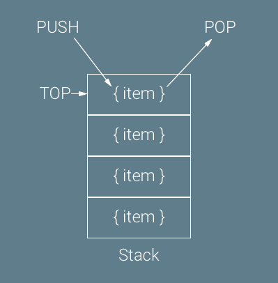
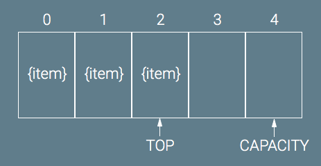

 

# Stacks and Queues

Peanut butter and jelly, Batman and Robin, Rick and Morty... stacks and queues are another iconic duo.

## Similarities
    Both Stacks and Queues are linear data structures and both flexible in size(n number of data).  They both only work on one piece of data at a time, because of this they are both efficient and fast to run. They are (O(1)) efficiency except the queues when used in an array(O(n)).  They can both be represented by an array and a linked list.

## Stacks
    The Stack collection of data is manipulated by "last in first out"(LIFO) meaning the last piece of information to be inputed is the first peice of information to be pulled out. You can think about it like a stack of pancakes, you stack the pancakes up and then serve them from the top down(you wouldn't take the bottom cold/squished pancakes would you?!?). 

    The methods used to manipulate the data within the structure are the array methods push(), pop(), and then a non array method used to view/access the tail of the data is called peek.

### Examples:
   - Instagram stories if you're moving backwards
   - Undo functions / command Z 
   - Back button on your browser
   - Social media timelines/most recent

## Queues
    The Queues collection of data is manipulated by "first in first out"(FIFO) meaning the oldest data is the first to served".  Think about a line at the airport security where the first person in line goes through the checkpoint before those who entered the checkpoint after. 

    The methods used to manipulate the data within the structure are enqueue(add data to the queue), and dequeue(remove data form queue).  Queues also use the peek to analyze/return the value of the first item in the data structure. 

### Examples:
   - Printers being sent documents to print
   - CPU scheduling (executing tasks in the order in which they are received)
   - Debugging ticketing system
   - Call center phone systems

## Photos/Screenshots
- Stack Data Structure

- Queue Data Structure

## Questions to be Asked
    - Can other array methods be used in stack other than push() and pop()?

## Additional Resources

